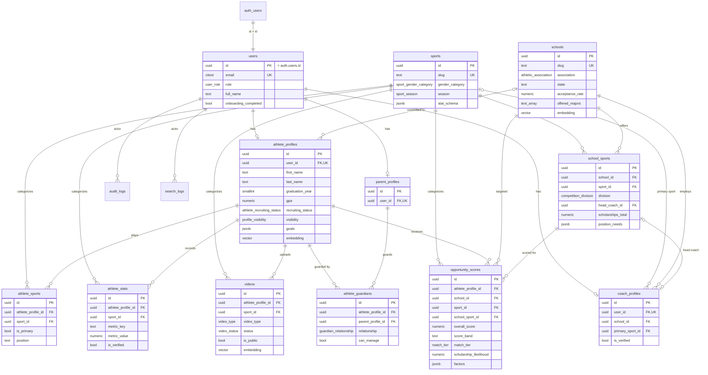

# Athlete Opportunity Engine — Database Architecture

> Production-ready Supabase (PostgreSQL 15/16 + pgvector) database for the
> Athlete Opportunity Engine (AOE). Authoritative companion to
> `ATHLETE_OPPORTUNITY_ENGINE_MASTER_PRD_v1.md`.

All SQL in `supabase/migrations/` has been **validated end-to-end against
PostgreSQL 16 + pgvector**: every migration applies cleanly, the seed runs
and is idempotent, and the Auth trigger / RLS policies / integrity guards
were verified with functional tests.

---

## 1. Architecture overview

```
Users → Vercel Edge → Next.js (App Router) → @supabase/supabase-js
                                                   │
                       ┌───────────────────────────┼───────────────────────────┐
                       ▼                           ▼                             ▼
                 Supabase Auth              PostgREST API                 Supabase Storage
                 (auth.users)        (RLS-enforced public schema)     (athlete-videos, avatars,
                       │                           │                       school-logos)
                       └────── trigger ───────────►│
                                                   ▼
                                       PostgreSQL 15 + pgvector
                                  ┌──────────────────────────────┐
                                  │ Identity   users              │
                                  │ Athletes   athlete_profiles   │
                                  │            parent_profiles    │
                                  │            coach_profiles      │
                                  │            athlete_sports      │
                                  │            athlete_guardians   │
                                  │            athlete_stats       │
                                  │            videos              │
                                  │ Schools    schools             │
                                  │            school_sports       │
                                  │            sports (catalog)    │
                                  │ Analytics  opportunity_scores  │
                                  │            audit_logs          │
                                  │            search_logs         │
                                  └──────────────────────────────┘
```

**Design principles**

- **Auth is the source of identity.** `public.users.id` *is* `auth.users.id`
  (1:1). A trigger provisions the app row on sign-up and mirrors the role into
  the JWT `app_metadata` so RLS authorizes statelessly (no recursive lookups).
- **Multi-sport by construction.** A canonical `sports` catalog is referenced
  by `athlete_sports`, `school_sports`, `athlete_stats`, `videos` and
  `opportunity_scores`. Adding a sport is a data operation, not a migration.
- **Multi-association.** `athletic_association` (NCAA/NAIA/NJCAA) on the school
  plus a precise `competition_division` enum on each program; a trigger
  guarantees a program's division belongs to its school's association.
- **Opportunity scoring is first-class.** `opportunity_scores` stores the
  composite plus all six PRD §12 components, a derived `score_band`, model
  version, and a structured `factors`/`explanation` payload for explainability.
- **Forward-compatible.** Embedding columns (pgvector) on schools/athletes/
  videos for the future **AI agent**; `scholarship_likelihood` +
  `projected_scholarship_amount` + program scholarship economics for the future
  **scholarship engine**; `offered_majors` / `goals` / `preferences` for the
  future **application/admissions assistant**.
- **Security in depth.** RLS on every table, least-privilege role grants,
  column-level privilege guards (no self role-escalation, admin-only
  verification), FERPA/COPPA-aware guardian access model, and an append-only
  audit log.

---

## 2. Schema summary

Authoritative DDL lives in `supabase/migrations/`. Required PRD tables in
**bold**; supporting tables enable integrity and the PRD analytics/audit needs.

| Table | Purpose | Key relationships |
|---|---|---|
| **users** | App identity, 1:1 with `auth.users`; carries `role` | PK = `auth.users.id` |
| **athlete_profiles** | Athlete academics, physical, recruiting, goals | → users; → schools (committed) |
| **parent_profiles** | Parent/guardian accounts | → users |
| **coach_profiles** | Coach accounts, school/sport affiliation | → users, schools, sports |
| **schools** | NCAA/NAIA/NJCAA institutions, academics, cost, embedding | — |
| **school_sports** | A school's program at a division; roster & scholarship economics | → schools, sports, coach_profiles |
| **athlete_stats** | Flexible per-metric performance data | → athlete_profiles, sports |
| **videos** | Highlight/film assets; AI analysis + embedding | → athlete_profiles, sports |
| **opportunity_scores** | Engine output: composite + 6 component fits | → athlete_profiles, schools, sports, school_sports |
| sports | Canonical multi-sport catalog | — |
| athlete_sports | Multi-sport junction (athlete↔sport) | → athlete_profiles, sports |
| athlete_guardians | Guardian linkage (parent↔athlete) with `can_manage` | → athlete_profiles, parent_profiles |
| audit_logs | Append-only audit trail (PRD §16) | → users |
| search_logs | Search usage analytics (PRD §10) | → users |

**Enumerated types** (see `..._init_enums.sql`): `user_role`, `gender`,
`athletic_association`, `competition_division`, `sport_gender_category`,
`sport_season`, `school_type`, `guardian_relationship`,
`athlete_recruiting_status`, `profile_visibility`, `coach_type`, `stat_source`,
`video_type`, `video_status`, `match_tier`, `opportunity_status`.

**Opportunity score components** (PRD §12 weights): `athletic_fit` 30%,
`academic_fit` 20%, `roster_fit` 25%, `major_fit` 10%, `location_fit` 10%,
`program_level_fit` 5% → `overall_score` (0–100). `financial_fit` is reserved
for the scholarship engine. `score_band` is a generated column:
`≥90 exceptional · ≥80 strong · ≥70 good · ≥60 possible · else low`.

---

## 3. SQL migration files

Run in lexicographic order (timestamp-prefixed):

| # | File | Contents |
|---|---|---|
| 00 | `20260616120000_init_extensions.sql` | `pgcrypto`, `pg_trgm`, `citext`, `vector` in `extensions` schema; search_path |
| 01 | `20260616120100_init_enums.sql` | All enumerated types |
| 02 | `20260616120200_init_functions.sql` | `set_updated_at`, `slugify`, `unaccent_fallback` |
| 03 | `20260616120300_core_users_and_sports.sql` | `users`, `sports` |
| 04 | `20260616120400_schools.sql` | `schools` + auto-slug trigger |
| 05 | `20260616120500_profiles.sql` | `athlete_profiles`, `parent_profiles`, `coach_profiles`, `athlete_sports`, `athlete_guardians` |
| 06 | `20260616120600_school_sports.sql` | `school_sports` + association/division guard |
| 07 | `20260616120700_athlete_stats.sql` | `athlete_stats` + verification sync |
| 08 | `20260616120800_videos.sql` | `videos` |
| 09 | `20260616120900_opportunity_scores.sql` | `opportunity_scores` (+ generated `score_band`) |
| 10 | `20260616121000_indexes.sql` | All btree/partial/GIN/trgm/HNSW indexes |
| 11 | `20260616121100_auth_hooks.sql` | `handle_new_user`, `sync_user_role_to_auth` |
| 12 | `20260616121200_rls_policies.sql` | RLS helpers + enable RLS + all policies |
| 13 | `20260616121300_roles_grants.sql` | Privilege guards + role grants + default privileges |
| 14 | `20260616121400_analytics_audit.sql` | `audit_logs`, `search_logs` (+ RLS/grants) |

---

## 4. Row Level Security

RLS is **enabled on every table**. `service_role` bypasses RLS (the engine and
back-office). Admins are identified by JWT `app_metadata.role = 'admin'`.

Helper functions (`SECURITY DEFINER`, owned by the migration role so they read
past RLS, avoiding recursion): `jwt_role()`, `is_admin()`, `is_privileged()`,
`current_athlete_profile_id()`, `is_guardian_of()`, `can_manage_athlete()`,
`can_view_athlete()`.

| Table | SELECT | INSERT / UPDATE / DELETE |
|---|---|---|
| users | self or admin | insert/delete admin; update self (role/email/is_active guarded to admins) |
| sports / schools / school_sports | public (anon + authenticated) | admin (school_sports also: program head coach) |
| athlete_profiles | owner, guardian, admin, or coach/public per `visibility` | owner or guardian (`can_manage`); admin |
| parent_profiles | self or admin | self or admin |
| coach_profiles | authenticated (directory) | self or admin; `is_verified` admin-only (guard) |
| athlete_sports / athlete_stats / videos | per `can_view_athlete` (videos also: public+ready) | owner/guardian (`can_manage`); admin |
| athlete_guardians | the athlete, the parent, or admin | athlete-owner or the parent; admin |
| opportunity_scores | owner or guardian; admin | engine (`service_role`) or admin |
| audit_logs | admin only | service_role / `log_audit()` |
| search_logs | own rows or admin | own rows |

**Privilege guards** (column-level, enforced by triggers, not just RLS):

- `users`: non-admins cannot change `role`, `email`, or `is_active`
  (blocks self role-escalation).
- `coach_profiles` / `athlete_profiles`: `is_verified` can only be set by an
  admin/service role.

**Verified by test:** athlete sees only own profile/scores; a second athlete
sees 0 of another's scores; a coach sees `recruiters_only` athletes but 0
private scores; anon is *denied* on `athlete_profiles` (no grant) while reading
reference data; self role-escalation raises an error and leaves the role
unchanged.

---

## 5. Index strategy

- **Foreign keys:** every FK has a supporting btree index, except where a
  composite `UNIQUE` already leads with that column
  (`athlete_sports`, `athlete_guardians`, `school_sports`, `users.email`).
- **Hot read paths (composite):**
  - `opportunity_scores (athlete_profile_id, overall_score DESC)` — athlete
    dashboard ranking.
  - `opportunity_scores (school_id, sport_id, overall_score DESC)` — recruiter
    "best-fit athletes" view.
  - `athlete_stats (athlete_profile_id, sport_id, metric_key)` — stat lookups;
    `(sport_id, metric_key, metric_value)` — peer benchmarking.
  - `school_sports (sport_id, division)` — program search.
- **Partial indexes** keep working sets small: active sports/schools/programs,
  verified stats, `videos` where `is_public AND status='ready'`, stale-score
  sweeps (`expires_at WHERE status='computed'`).
- **Fuzzy search:** `gin_trgm_ops` on `schools.name` (PRD school search).
- **Attribute filters:** GIN (`jsonb_path_ops`) on `schools.metadata`,
  `athlete_profiles.preferences`, `school_sports.position_needs`,
  `opportunity_scores.factors`; GIN on `schools.offered_majors` and
  `videos.ai_tags` arrays.
- **Vector / AI (HNSW, cosine):** `schools.embedding`,
  `athlete_profiles.embedding`, `videos.embedding` (1536-dim,
  `text-embedding-3-small`). pgvector operators (`<=>`, `<->`, `<#>`) resolve
  unqualified via the `extensions` search_path set in migration 00.

---

## 6. Seed strategy

Two layers (details in `supabase/seed/README.md`):

1. **Reference data** — `supabase/seed.sql` (auto-run by `supabase db reset`):
   20 sports across the PRD sport list, 8 schools spanning NCAA D-I/D-II/D-III,
   NAIA and NJCAA, and 11 programs with `position_needs`. Idempotent
   (`ON CONFLICT` upserts).
2. **App/auth data** — `supabase/seed/seed_app_data.ts` (run with the service
   role key): creates the PRD demo personas through the Auth Admin API
   (Jacob/athlete, Jennifer/parent, Coach Davis, admin), then their profiles,
   sports, stats, a highlight video, a guardian link, and a sample opportunity
   score. Idempotent.

---

## 7. Relationship diagram



---

## 8. Deployment instructions

### Prerequisites
- Supabase project (hosted) or the Supabase CLI for local dev.
- `pgvector` is available on all Supabase projects (enabled by migration 00).

### Local development
```bash
supabase init            # if not already initialized
supabase start           # boots local Postgres + Auth + Storage
supabase db reset        # applies all migrations + runs seed.sql

# Seed auth-dependent demo data (service role key from `supabase status`)
export SUPABASE_URL="http://localhost:54321"
export SUPABASE_SERVICE_ROLE_KEY="<service_role key>"
npx tsx supabase/seed/seed_app_data.ts
```

### Hosted Supabase (staging / production)
```bash
supabase link --project-ref <your-project-ref>
supabase db push                 # apply migrations to the linked project
# Reference data:
psql "$SUPABASE_DB_URL" -f supabase/seed.sql      # optional in prod
# App demo data (non-prod only):
npx tsx supabase/seed/seed_app_data.ts
```
Enable **Point-in-Time Recovery** and automatic backups (PRD §8) in the
Supabase dashboard. Configure Auth providers (Email/Password, Magic Link,
OAuth — PRD §15) under Authentication → Providers.

### Vercel (Next.js front end / API)
Set environment variables (Project → Settings → Environment Variables):

| Variable | Scope | Notes |
|---|---|---|
| `NEXT_PUBLIC_SUPABASE_URL` | client + server | `https://<ref>.supabase.co` |
| `NEXT_PUBLIC_SUPABASE_ANON_KEY` | client + server | RLS-restricted anon key |
| `SUPABASE_SERVICE_ROLE_KEY` | **server only** | engine writes (scores), admin ops — never exposed to the browser |

The opportunity engine and back-office jobs should use the service role key
(bypasses RLS); all user-facing requests use the anon key + the user's JWT so
RLS applies.

### CI/CD
- Migrations are forward-only and ordered; run `supabase db push` (or
  `supabase migration up`) in the deploy pipeline before shipping app code.
- Keep `supabase/migrations/` as the single source of truth — never edit a
  shipped migration; add a new one.
